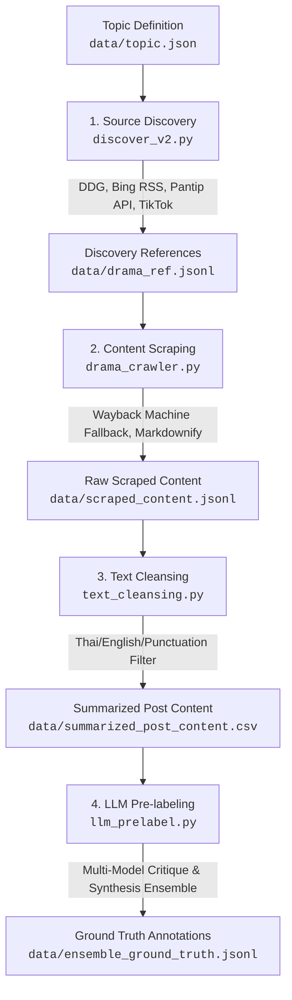

## 📌 Pipeline Overview



---

## 🛠️ Key Pipeline Stages

### 1. Source Discovery (`discover_v2.py` / `source_discover.py`)
Discovers relevant news articles, blog posts, forum discussions, and video links for each topic in `data/topic.json`.
- **DuckDuckGo Search (`ddgs`)**: Primary keyless web & news discovery tailored to the Thailand region (`th-th`).
- **Bing News RSS**: Secondary fallback feed mechanism.
- **Pantip Search**: Direct native API endpoint (`https://pantip.com/api/forum-service/home/get_search`) with BeautifulSoup HTML parsing fallback for Thai forum topics.
- **TikTok Web Search**: Constructs targeted video and comment search URLs.

### 2. Content Scraping (`drama_crawler.py`)
Scrapes full article bodies and user comments from discovered URLs.
- **Redirect Resolution**: Resolves Google News RSS redirect URLs using `googlenewsdecoder`.
- **Wayback Machine Fallback**: Automatically fetches cached snapshots from Archive.org if a web source returns HTTP 403 or is blocked.
- **Markdown Conversion**: Converts raw HTML DOM to structured Markdown via `BeautifulSoup` and `markdownify`.
- **Custom Forum Scraper**: Specialized extraction for Pantip main posts and top comments.

### 3. Text Cleansing (`text_cleansing.py`)
Cleans and normalizes the scraped Markdown data.
- **Allowed Character Filtering**: Retains only:
  - **Thai Unicode Characters** (`\u0e00-\u0e7f`)
  - **English Letters** (`a-zA-Z`)
  - **Digits** (`0-9`)
  - **Standard ASCII & Markdown Punctuation** (`!"#$%&'()*+,-./:;<=>?@[\]^_`{|}~`)
  - **Whitespace & Newlines** (`\s`)
- **Noise Stripping**: Removes emojis, foreign non-Latin scripts (Chinese, Cyrillic, etc.), control characters, and encoding artifacts.

### 4. LLM Ground Truth Annotation (`llm_prelabel.py`)
Generates structured NLP pre-labeling annotations using an asynchronous Multi-Model Critique & Synthesis Ensemble via OpenRouter.
- **Stage 1: Multi-Model Parallel Critique**:
  - Concurrently queries 3 critique models per topic using `asyncio.gather`:
    - `deepseek/deepseek-v4-flash`
    - `qwen/qwen3.7-flash`
    - `google/gemini-3.5-flash-lite`
  - Each critique model evaluates summarized posts for macro trends and micro post annotations.
- **Stage 2: Meta-Synthesis**:
  - Uses `openai/gpt-5.6-terra` as Lead Meta-Summarizer to synthesize all 3 critique reports into a single ground-truth JSON structure.
  - Resolves minor sentiment and stance disagreements using majority consensus.
- **Macro Trend Summary**:
  - `extractive_summary`: Factual 2–3 sentence summary of what actually happened.
  - `public_opinion_direction`: Summary of public reaction, debates, and dominant viewpoints.
  - `key_polarization_axis`: Main conflict axis (e.g., *Authentic Ingredients vs. Food Innovation*).
- **Deterministic Sentiment Ratios**: `estimated_sentiment_distribution` (`positive`, `neutral`, `negative`) computed directly in Python from final micro annotations.
- **Micro Post Annotations**:
  - `title_or_snippet`: Title or key sentence snippet.
  - `sentiment_label`: `Positive`, `Neutral`, or `Negative`.
  - `stance_label`: Core stance (e.g., *Purist*, *Pragmatist*, *Brand Defense*, *Skeptical*).
  - `is_sarcastic`: Flag for Thai internet irony, double meaning, or sarcasm.
- **Fault-Tolerant & Resumable Execution**: Resumable pipeline that checks `data/ensemble_ground_truth.jsonl` to skip previously annotated topics and flushes progress to disk.

---

## 📁 Repository Structure

```
DEEDY/
├── data/
│   ├── topic.json                    # Input topics & search keywords
│   ├── drama_ref.jsonl               # Discovered reference URLs per topic
│   ├── scraped_content.jsonl         # Raw scraped Markdown content
│   ├── scraped_content_cleaned.jsonl # Cleaned Markdown text
│   ├── summarized_post_content.csv   # Pre-summarized vLLM CSV dataset
│   └── ensemble_ground_truth.jsonl   # Final LLM ensemble pre-labeled ground truth
├── web_scraping/                     # Discovery and crawler modules
│   ├── discover_v2.py                # Multi-source web discovery engine
│   ├── drama_crawler.py              # Scraper with Wayback Machine fallback
│   └── source_discover.py            # Legacy source discovery script
├── text_cleansing.py                 # Text normalization & character filtering
├── llm_prelabel.py                   # Multi-model critique & synthesis pre-labeling engine
└── README.md                         # Documentation
```

---

## 🚀 Getting Started

### Prerequisites

Install Python 3.10+ and required packages:
```bash
pip install requests beautifulsoup4 feedparser markdownify duckduckgo_search pydantic tqdm python-dotenv openai
```

Set your OpenRouter API Key in a `.env` file in the project root:
```env
OPENROUTER_API_KEY="your-openrouter-api-key-here"
```

---

## 💻 Running the Pipeline

### Step 1: Discover Sources
```bash
python discover_v2.py
```

### Step 2: Scrape Content
```bash
python drama_crawler.py
```

### Step 3: Clean & Normalize Text
```bash
python text_cleansing.py
```

### Step 4: Run LLM Pre-labeling Pipeline
```bash
python llm_prelabel.py
```

---

## 📊 Output Data Format

Example JSON object in `data/ensemble_ground_truth.jsonl`:

```json
{
  "topic": "ผัดกะเพราที่แท้จริงต้องใส่แค่กะเพรา...",
  "macro_summary": {
    "extractive_summary": "ดราม่าเรื่องส่วนผสมของผัดกะเพราไทย...",
    "public_opinion_direction": "ผู้บริโภคแบ่งออกเป็นกลุ่มอนุรักษ์นิยมและกลุ่มเน้นความสะดวก...",
    "key_polarization_axis": "Authentic Ingredients vs. Commercial Innovation",
    "estimated_sentiment_distribution": {
      "positive": 0.20,
      "neutral": 0.30,
      "negative": 0.50
    }
  },
  "micro_post_annotations": [
    {
      "title_or_snippet": "KFC หยิบอินไซต์ 'กะเพราไม่แท้' ปั้นหนังสั้นโปรโมตเมนูใหม่",
      "sentiment_label": "Neutral",
      "stance_label": "Commercial Innovation",
      "is_sarcastic": false
    }
  ]
}
```
