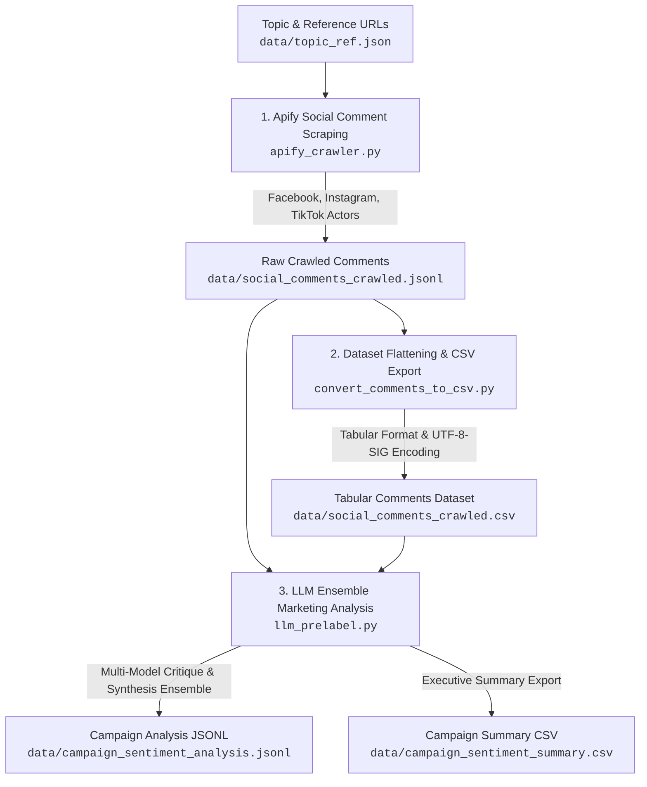

## 📌 Pipeline Overview



---

## 🛠️ Key Pipeline Stages

### 1. Apify Social Comment Crawler (`apify_crawler.py`)
Scrapes user comments across social media platforms for targeted marketing campaign topics defined in `data/topic_ref.json`.
- **Platform Auto-Detection**: Inspects URL patterns to automatically route target links to the appropriate scraper:
  - **Facebook**: `apify/facebook-comments-scraper`
  - **Instagram**: `apify/instagram-comment-scraper`
  - **TikTok**: `clockworks/tiktok-comments-scraper`
- **Data Normalization & Pydantic Validation**: Sanitizes raw actor payloads (handles nested user metadata, dict/primitive conversion, missing fields) into strict `ExtractedComment` and `SocialPostCommentsResult` schemas.
- **Topic Comment Cap & Resumable Execution**: Caps comment extraction per topic (default 1,000 comments/topic) and skips already processed topics in `data/social_comments_crawled.jsonl`.

### 2. Comment Dataset Flattening & CSV Export (`convert_comments_to_csv.py`)
Flattens nested JSONL comment payloads into a structured CSV file for data inspection and analysis.
- **Tabular Column Mapping**: Extracts key fields: `Topic`, `comment`, `Author`, `Likes_Count`, `Platform`, `Post_URL`, `Comment_ID`, `Parent_Comment_ID`, and `Timestamp`.
- **Unicode / Excel Compatibility**: Exports using `utf-8-sig` encoding to properly render Thai characters and symbols in Excel.

### 3. LLM Ensemble Marketing & Sentiment Analysis (`llm_prelabel.py`)
Generates comprehensive marketing campaign insights and sentiment pre-labeling annotations via OpenRouter using an asynchronous Multi-Model Critique & Synthesis Ensemble.
- **Stage 1: Multi-Model Parallel Critique**:
  - Concurrently queries 3 critique models per topic using `asyncio.gather`:
    - `deepseek/deepseek-v4-flash`
    - `qwen/qwen3.7-flash`
    - `google/gemini-3.5-flash-lite`
  - Each critique model evaluates comment samples for individual comment sentiment (`Positive`, `Neutral`, `Negative`), public reaction themes, marketing campaign next steps, and operational business adjustments.
- **Stage 2: Meta-Synthesis**:
  - Uses `openai/gpt-5.6-terra` as Lead Marketing Strategist & Meta-Summarizer to synthesize all 3 critique reports into a unified consensus analysis.
- **Exact Sentiment Ratios**: Calculates scaled positive, neutral, and negative comment counts along with percentage distributions.
- **Resumable Output**: Saves detailed JSON records to `data/campaign_sentiment_analysis.jsonl` and flattens an executive summary report to `data/campaign_sentiment_summary.csv`.

---

## 📁 Repository Structure

```
DEEDY/
├── data/
│   ├── topic_ref.json                   # Input campaign topics & social reference URLs
│   ├── social_comments_crawled.jsonl    # Raw scraped social comments from Apify
│   ├── social_comments_crawled.csv      # Exported tabular comments dataset
│   ├── campaign_sentiment_analysis.jsonl# Full LLM ensemble marketing analysis
│   └── campaign_sentiment_summary.csv  # Flattened executive summary CSV report
├── apify_crawler.py                     # Apify comment scraper wrapper & pipeline
├── convert_comments_to_csv.py           # JSONL comment flattening utility
├── llm_prelabel.py                      # Multi-model critique & synthesis analysis engine
├── .env                                 # API configuration (Apify & OpenRouter keys)
└── README.md                            # Documentation
```

---

## 🚀 Getting Started

### Prerequisites

Install Python 3.10+ and required dependencies:
```bash
pip install apify-client pydantic pandas openai tqdm python-dotenv
```

Set your API keys in a `.env` file in the project root:
```env
APIFY_API_TOKEN="your-apify-api-token-here"
OPENROUTER_API_KEY="your-openrouter-api-key-here"
```

---

## 💻 Running the Pipeline

### Step 1: Scrape Social Comments via Apify
```bash
python apify_crawler.py
```

### Step 2: Convert Crawled Comments to CSV
```bash
python convert_comments_to_csv.py
```

### Step 3: Run LLM Ensemble Marketing Analysis
```bash
python llm_prelabel.py
```

---

## 📊 Output Data Formats

### 1. Crawled Comments (`data/social_comments_crawled.jsonl`)

```json
{
  "topic": "Parameter Gelato",
  "platform": "TikTok",
  "post_url": "https://www.tiktok.com/@krissrepoomseth/video/7647915423660264722",
  "total_comments": 45,
  "comments": [
    {
      "comment_id": "7647920112345678901",
      "platform": "TikTok",
      "post_url": "https://www.tiktok.com/@krissrepoomseth/video/7647915423660264722",
      "author": "IceCreamLover",
      "text": "รสชาตินี้อร่อยมากครับ อยากให้ทำไซส์ใหญ่ขึ้น",
      "likes_count": 12,
      "parent_comment_id": null,
      "timestamp": "2026-08-01T10:15:30Z"
    }
  ]
}
```

### 2. Campaign Analysis (`data/campaign_sentiment_analysis.jsonl`)

```json
{
  "topic": "Parameter Gelato",
  "total_comments_analyzed": 45,
  "sentiment_direction_analysis": "ผู้บริโภคส่วนใหญ่ให้ผลตอบรับเชิงบวกต่อรสชาติไอศกรีม...",
  "sentiment_counts": {
    "positive": 30,
    "neutral": 10,
    "negative": 5,
    "positive_ratio": 0.6667,
    "neutral_ratio": 0.2222,
    "negative_ratio": 0.1111
  },
  "suggestions": {
    "campaign_next_steps": "ขยายแคมเปญโปรโมตกลุ่มสินค้าใหม่ และร่วมมือกับอินฟลูเอนเซอร์สายอาหาร...",
    "business_changes_needed": "เพิ่มกำลังการผลิต และปรับปรุงระบบการจัดส่งไอศกรีมให้คงความเย็นดียิ่งขึ้น"
  }
}
```
