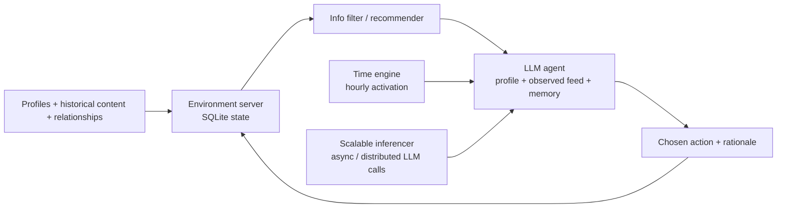
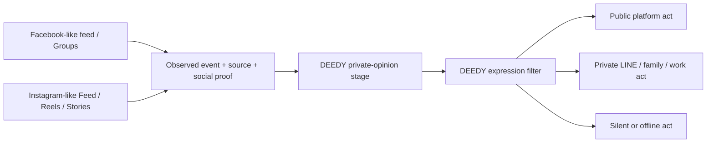

# OASIS Research: Facebook, Instagram, and a Thai Social-Media Context

> Research date: 2026-08-08  
> Scope: OASIS mechanics, a credible path to Facebook-/Instagram-like environments, Thai-context adaptation, and Thai-language research evidence.  
> Terminology: “Facebook-like” and “Instagram-like” mean a research simulation inspired by observable product mechanics. They do **not** claim to reproduce Meta’s proprietary ranking systems.

## Bottom line

Yes, OASIS can be extended beyond X and Reddit, but it does **not** currently ship ready-made Facebook or Instagram environments. Its documented built-in `DefaultPlatformType` values are only Twitter-like and Reddit-like; its documented extension point is a custom `Platform` instance. [OASIS Platform documentation](https://docs.oasis.camel-ai.org/key_modules/platform)

Changing this repository’s platform setting from `twitter` to `facebook` would not create Facebook. A credible implementation needs to model five things together:

1. **Platform objects** — posts, comments, reactions, follows/friends, pages, groups, stories, reels, etc.
2. **Action space** — which actions an agent can take, including their inputs and state transitions.
3. **Information filter / recommender** — which items each agent is actually exposed to.
4. **Agent observation and prompt** — what the agent sees and how it interprets platform-specific social cues.
5. **Calibration and validation** — evidence-based behaviour distributions, repeated runs, and held-out aggregate comparisons.

For a question about *platform diffusion*—for example, “how would a post spread through Thai Facebook Pages and Groups?”—an OASIS-derived custom platform is appropriate. For a question about *Thai society* more broadly—private belief, LINE, family/work discussion, offline action, and silence—the DEEDY `backend/core/` should be the primary model, with Facebook and Instagram as channels inside a wider multi-channel world.

## 1. What OASIS actually is

OASIS is an LLM-agent social-media simulation framework, not a pre-trained predictor of a particular country or platform. The OASIS paper describes five foundational components:



The paper calls these the **Environment Server**, **RecSys/Info Filter**, **Agent Module**, **Time Engine**, and **Scalable Inferencer**. The official paper states that the environment stores users, posts, comments, relationships, action traces, and recommendations; the recommender determines content visibility; and actions update the environment in real time. [Yang et al., *OASIS*—method and architecture](https://arxiv.org/html/2411.11581v5#S2)

### 1.1 Registration phase

OASIS starts by registering a profile, self-description, historical content, and relationships for each agent. It gives the LLM a persona plus a limited action set. The profile and past behaviour are inputs to both agent prompting and content recommendation. [OASIS paper—workflow](https://arxiv.org/html/2411.11581v5#S2.SS1)

In this repository, that role is implemented by:

```text
Zep graph entity
  → OasisProfileGenerator
  → twitter_profiles.csv / reddit_profiles.json
  → generate_twitter_agent_graph() / generate_reddit_agent_graph()
```

`OasisProfileGenerator` enriches graph entities with Zep retrieval, then generates persona fields such as biography, personality, interests, demographics, and platform-account attributes.

### 1.2 Simulation loop

At every simulated step:

1. The simulation clock advances.
2. The time engine probabilistically activates users based on an hourly activity profile.
3. The platform/recommender refreshes candidate content for active users.
4. Each agent observes its profile, past state, and a constrained view of the feed.
5. The LLM chooses one permitted action (or a scripted `ManualAction` is injected).
6. The environment validates the action, persists it, updates counts/relations/content, and records a trace.
7. Later recommendation passes expose the changed world to other agents.

The OASIS paper uses a 24-value hourly activity vector and describes a three-minute default time step. The exact step duration and activation schedule are experiment settings, not universal social facts. [OASIS paper—simulation phase and time engine](https://arxiv.org/html/2411.11581v5#S2.SS1)

The current MiroFish wrappers follow this model but use their own generated Thai activity multipliers and typically activate only the eligible agents in each round. `SimulationRunner` runs the OASIS scripts in a subprocess, tails `actions.jsonl`, and exposes status to the Vue UI.

### 1.3 Environment server and actions

OASIS’s `Platform` owns a SQLite database, a simulated clock, a recommender configuration, and action handlers. An incoming action is dispatched to a platform method based on its action type. This is the key extension boundary: a new action needs both an action definition and an environment-state handler that validates and persists it. [OASIS `Platform` implementation](https://github.com/camel-ai/oasis/blob/main/oasis/social_platform/platform.py)

The original paper enumerates 21 text-platform interactions, including post/comment creation, reposting, follow/unfollow, mute, like/dislike, refresh, search, trend, and doing nothing. The current project documentation advertises 23 actions, so the precise count has changed across OASIS versions; code must target the pinned library version instead of assuming a fixed number. [OASIS paper—agent action module](https://arxiv.org/html/2411.11581v5#S2.SS4) [OASIS repository](https://github.com/camel-ai/oasis)

This MiroFish project pins `camel-oasis==0.2.5`. Its actual runner limits actions to a smaller platform-specific subset:

| Current runner | Enabled actions |
| --- | --- |
| Twitter-like | create post, like, repost, follow, quote post, do nothing |
| Reddit-like | create post/comment, votes, search, trend, refresh, follow, mute, do nothing |

The project constrains actions intentionally. A narrow, scenario-relevant action space is safer and more interpretable than enabling everything.

### 1.4 Recommendation is the social mechanism

The recommender is not a cosmetic implementation detail: it determines what information agents receive, therefore it shapes the possible cascade.

- The X-like OASIS model combines followed-account content with out-of-network content. Its paper-level model ranks out-of-network candidates using recency, creator follower count, and semantic similarity between the post and an embedding-based user representation.
- The Reddit-like model ranks community content with a time-decayed engagement (“hot”) score.
- The generic OASIS `Platform` can be configured with random, Reddit-like, Twitter-like, or TWHIN-based recommendation modes, but these are still approximations rather than production platform algorithms. [OASIS paper—RecSys](https://arxiv.org/html/2411.11581v5#S2.SS3) [OASIS configuration documentation](https://docs.oasis.camel-ai.org/key_modules/platform)

The OASIS authors explicitly say their current recommender is only high-level; it lacks more complex mechanisms such as collaborative filtering and consequently has a gap from real-world diffusion. They also say the baseline environment is text-only and does not model image, video, or audio perception. These limitations are especially relevant for Instagram. [OASIS paper—limitations](https://arxiv.org/html/2411.11581v5#S5)

## 2. What “custom platform” means in practice

OASIS documentation allows `oasis.make()` to receive a custom `Platform` object instead of `DefaultPlatformType.TWITTER` or `.REDDIT`. This reuses the simulation lifecycle, agent graph, async execution, clock, and database-oriented environment model. It does **not** automatically provide Facebook/Instagram schemas, rankings, or agent actions. [OASIS Environment documentation](https://docs.oasis.camel-ai.org/key_modules/environments)

### 2.1 Extension layers

| Layer | Reuse from OASIS | Must be designed for a Meta-like environment |
| --- | --- | --- |
| Execution | `env.reset()`, `env.step()`, async action handling, concurrency, simulated clock | Platform-specific scheduled events and exposure policies |
| Agents | `AgentGraph`, profiles, model management, action restriction | Thai platform persona, media-literacy/risk context, prompt/observation schema |
| State | SQLite storage, traces, social relation primitives | Pages, Groups, creators, media assets, story expiry, Reels, saves, distribution surfaces |
| Actions | Agent action-selection pattern | Reactions, share targets, Group/Page posting, story/reel production, save, story reply, collaboration, etc. |
| Recommender | Candidate/ranking pattern and embedding hooks | Separate Feed/Group/Reels/Stories surfaces and their tunable candidate/rank functions |
| Analytics | Trace collection and the MiroFish monitor/report seam | Platform-specific exposure, completion/view, reshare, group and media metrics |

### 2.2 Do not model the actual Meta algorithms

Meta’s production ranking logic is proprietary and changes continuously. A research model should use a declared, tunable policy rather than pretending to know its exact algorithm. Call the result **Facebook-like** or **Instagram-like** and publish the candidate-generation and ranking functions in the experiment configuration.

This approach is also scientifically stronger: changing a recommender coefficient becomes an explicit counterfactual experiment (“What if Group membership mattered more?”), rather than an undocumented imitation claim.

## 3. A Facebook-like OASIS environment

### 3.1 Minimum viable scope

Start with a text-first, feed-and-community model. It can answer questions about public information exposure and sharing without claiming to simulate every Facebook feature.

**Actors and relationships**

- individual account;
- Page (news outlet, agency, brand, creator);
- Group;
- friendship/follow relationship;
- Group membership and Page following; and
- optional trusted ties such as family/work/community, which should come from DEEDY rather than be inferred from a public graph.

**Content state**

- post: text, URL, `media_proxy`, author, surface, timestamp, visibility;
- comment/reply tree;
- reaction counts by type;
- share/reshare provenance;
- report/moderation status; and
- optional event/RSVP object only if the study requires it.

`media_proxy` is a structured description rather than a generated image in the first release, for example:

```json
{
  "format": "video",
  "visual_topics": ["flood", "Bangkok"],
  "caption": "...",
  "emotion": "fear",
  "source_credibility": "unknown"
}
```

This makes visual salience a measurable variable while respecting OASIS’s text-only baseline. A later multimodal release can replace it with approved media plus a vision-language observation step.

**Initial action set**

- create post; comment/reply; react; share; quote share;
- follow/unfollow Page; join/leave Group;
- post in Group; report; hide/unfollow; and
- do nothing.

Do not include private Messenger content in the first public-platform model. Private messaging has a different consent/privacy boundary and should be represented, if needed, as an aggregate DEEDY private-channel event—not collected or replayed real messages.

### 3.2 Feed model

Generate candidates from four declared pools:

1. friend/followed-account content;
2. Group and Page content;
3. recommended public content; and
4. sponsored/seeded experimental content (only when clearly labelled in the experiment).

Then rank candidates using a transparent model, for example:

```text
rank = w_affinity × relationship_strength
     + w_interest × topic_match
     + w_recency × freshness
     + w_social_proof × reactions_and_reshares
     + w_source × source_credibility
     + w_group × group_membership
     + exploration_noise
```

The weights are hypotheses to calibrate, not claims about Facebook. Log *every exposure*—not only actions—so later analysis can distinguish “did not act” from “was never shown the item.”

### 3.3 Thai-specific Facebook hypotheses

Use these as testable starting hypotheses, not stereotypes:

- Model **Pages** and **Groups** as separate candidate sources; a recent Thai Facebook study found news pages were the main news-following channel in its sample.
- Include source credibility as an agent-specific variable; that same study found perceived source reliability related to news sharing.
- Include an emotional state but validate its behavioural effect empirically. A Bangkok undergraduate study found different controversy-sharing patterns across several emotions, while fear/anxiety did not differentiate sharing in that sample. Do not hard-code “higher fear always means fewer shares.”
- Let language generation vary by audience, relationship, and risk. Thai-English switching can express politeness, respect, affect, identity, or group membership, rather than being mere noise. [Hoaihongthong & Panjanghan (2025)](https://so04.tci-thaijo.org/index.php/jil/article/view/276323) [Prasitrittichai, Bhibulbhanuvat & Boonrugsa (2024)](https://so12.tci-thaijo.org/index.php/jcmn/article/view/1198) [Kongkerd (2015)](https://so01.tci-thaijo.org/index.php/executivejournal/article/view/81265)

## 4. An Instagram-like OASIS environment

Instagram cannot be modelled credibly as “Twitter with photos.” Its core observation surfaces and short-lived/multimodal artefacts are different.

### 4.1 Minimum viable scope

**Actors and relationships**

- personal/creator/brand accounts;
- one-way follows;
- optional close-friends relation, generated synthetically; and
- creator attributes such as content niches and audience size.

**Content surfaces**

| Surface | Minimum state | First-release interactions |
| --- | --- | --- |
| Feed post/carousel | caption, media proxy, hashtags, creator, timestamp | like, comment, save, share, follow |
| Reel | video proxy, caption, audio/trend label, duration/completion bucket | view, complete/skip, like, comment, save, share, follow |
| Story | media proxy, audience, created/expiry time | view, reaction, reply; delete at expiry |
| Profile | bio, followed topics, past content summaries | follow/unfollow |

Avoid direct messages in the first model for the same privacy and observability reason as Messenger.

### 4.2 Multiple recommenders, not one feed

Use separate candidate generation and ranking for Feed, Reels, and Stories. A simple research policy can distinguish:

- **Feed:** relationship strength, interest match, recency, interactions with similar authors/content.
- **Reels:** topic/format match, novelty, engagement/completion proxy, creator reach, exploration.
- **Stories:** relationship/close-friend strength, recency, previous story viewing.

Track view, skip, completion, save, and share separately. Treating all of them as “likes” erases the mechanism that makes visual short-form content different from text posts.

### 4.3 Thai-specific Instagram hypotheses

Thai-English code mixing is relevant to captions and comments. A Thai-user Instagram study of 40 accounts identified lexical insertion, translation, repetition, specialised forms, and net-culture switching; it reports that code mixing can express emotion and bilingual/social identity. That supports a format-aware Thai language layer, but the small qualitative sample does not justify population rates. [Jintanawong (2020), *Thai and English Code-Mixing on Instagram by Thai Users*](https://rsucon.rsu.ac.th/2020/paper/1636)

Use a profile field such as `language_style` rather than making every Thai agent write the same informal Thai. Example values might include standard Thai, Thai-English mixed, regional register, formal institutional Thai, and fan/creator net culture. Those settings must be derived from consented data or a declared synthetic sampling rule; they must not imitate a specific identifiable account.

## 5. Recommended implementation plan for this repository

### Phase A — make one transparent Facebook-like prototype

Do **not** first modify the existing Twitter runner in place. Create a separately testable implementation:

```text
backend/
  platforms/
    meta_common/
      schemas.py           # media proxy, exposure, reaction, Page/Group data
      ranking.py            # candidate pools + declared scoring policy
      thai_observation.py   # feed summary supplied to an agent
    facebook_like/
      platform.py
      actions.py
      profiles.py
      runner.py
      tests/
```

Recommended order:

1. Create the SQLite schema and action traces first.
2. Implement deterministic action handlers and feed ranking with fixed fixtures.
3. Add Thai profiles and language generation after state transitions are correct.
4. Add LLM decisions with a restricted action set.
5. Integrate the subprocess with the MiroFish monitor only after standalone tests pass.

This order prevents a fluent LLM from hiding a broken platform mechanism.

### Phase B — add the MiroFish adapter

The MiroFish application shell currently hard-codes platform assumptions in more than the OASIS script:

- `SimulationManager.PlatformType` lists only `twitter` and `reddit`.
- `SimulationConfigGenerator` creates only `twitter_config` and `reddit_config`.
- `SimulationRunner` chooses only Twitter, Reddit, or the parallel runner and monitors only their two `actions.jsonl` files.
- Profile files are written in OASIS’s Twitter CSV / Reddit JSON formats.
- The post/comment API readers expect Twitter/Reddit SQLite tables.

Therefore a Facebook/Instagram extension needs a **platform adapter contract**, not only a custom OASIS class:

```text
Platform adapter
  input:  simulation_config.json + platform profile file
  output: <simulation>/<platform>/actions.jsonl + platform database
  IPC:    interview / batch interview / close environment
  query:  standard post, comment, action, and exposure methods
```

Keep the existing `actions.jsonl` envelope (`round`, timestamp, agent identity, action type, action arguments, result, success). Put platform-specific fields—reaction type, surface, group/page ID, media proxy, exposure source, completion bucket—inside `action_args` and `result`. This preserves the monitor, audit trail, and report pipeline.

### Phase C — consider Instagram after Facebook validation

Instagram needs short-lived content and multimodal proxies. Adding it before the Facebook-like state/recommender is validated would multiply unknowns. Reuse `meta_common` only where the interaction semantics truly match; do not force Stories, Reels, or completion metrics into a generic text-post schema.

### Phase D — connect to DEEDY, not just OASIS

For Thai society research, model platform exposure as one input to the DEEDY agent:



This retains the key DEEDY contribution: platform engagement is observable, while private belief and non-posting behaviour are not discarded.

## 6. Thai research evidence found

### Direct answer

I did **not** find a Thai paper that applies OASIS specifically to Facebook or Instagram, nor a Thai Facebook/Instagram agent-based simulation paper that can simply be copied into this project. The useful literature is adjacent: Thai platform use, commenting/sharing, news exposure, cross-platform expression, and Thai-language practice. This is still valuable for model variables and calibration targets, but it is not validation of an OASIS extension.

| Study | Evidence | What it can inform | Important limit |
| --- | --- | --- | --- |
| Panklad & Chartprasert (2022), 499 Thai Facebook users | Political-information exposure, content/page exposure, commenting, and exchanging diverse viewpoints were associated with internal political efficacy. | Facebook profile variables: political-information use, Page exposure, commenting tendency, viewpoint diversity. | Survey association; it does not reveal Meta ranking weights or causal effects. |
| Prasitrittichai, Bhibulbhanuvat & Boonrugsa (2024), 400 Bangkok undergraduates | Most participants showed moderate controversy-sharing; several emotional states related to different sharing patterns; fear/anxiety did not distinguish sharing in the sample. | Emotional/action calibration and a reason to test mechanisms rather than assume them. | One age/location group; not a Thailand-wide distribution. |
| Hoaihongthong & Panjanghan (2025), 400 Facebook users | News Pages were the main news-following channel; source reliability, video/social-news preferences, interest pages, and bedtime checks featured in reported behaviour. | Page candidate pool, source reliability, content format, and diurnal schedule hypotheses. | Self-reported behaviour; not direct exposure/ranking logs. |
| NeVille & Sirasoonthorn (2021), 52 Thai university students | Facebook, Instagram, and Twitter were described as platforms for social learning and expression. | Cross-platform design: do not assume one platform plays every social role. | Qualitative student sample. |
| Jintanawong (2020), 40 Thai Instagram accounts | Thai-English code mixing in captions/comments occurred in several linguistic forms and expressed emotion/identity. | Caption/comment language-style fields and Thai generation evaluation. | Small qualitative corpus; no population proportion. |
| Kongkerd (2015), Thai Facebook English chats | Code switching/mixing served politeness/respect, clear affect/meaning, and identity/group membership. | Audience- and relationship-sensitive Thai/English generation. | Focused on English chat practice, not all Facebook content. |

Source links: [Panklad & Chartprasert](https://so02.tci-thaijo.org/index.php/jcomm/article/view/258151), [Prasitrittichai et al.](https://so12.tci-thaijo.org/index.php/jcmn/article/view/1198), [Hoaihongthong & Panjanghan](https://so04.tci-thaijo.org/index.php/jil/article/view/276323), [NeVille & Sirasoonthorn](https://so02.tci-thaijo.org/index.php/hasss/article/view/235276), [Jintanawong](https://rsucon.rsu.ac.th/2020/paper/1636), [Kongkerd](https://so01.tci-thaijo.org/index.php/executivejournal/article/view/81265).

## 7. How to calibrate a Thai model responsibly

### 7.1 Build parameters from evidence, not prompts alone

Separate inputs into three tiers:

| Tier | Examples | Use |
| --- | --- | --- |
| Structural | public Pages/Groups, follows/memberships, post/comment/reaction/share relationships | Build synthetic topology and candidate pools only when collection/permission is lawful |
| Behavioural | active-hour distribution, probability of view/like/comment/share/save, source-following patterns | Tune non-LLM action/exposure probabilities |
| Linguistic | Thai register, code mixing, emoji/hashtag use, caption length, formality | Evaluate generated text style and prompt variants |

Use aggregates, archetypes, and synthetic agents—not 1:1 “digital twins” of ordinary people. Preserve provenance, remove PII, and comply with the source-policy fail-closed design already in `core/pipeline/sources.py`.

### 7.2 Validation protocol

Before claiming that a model represents Thai Facebook/Instagram behaviour:

1. Write the scenario, allowed actions, ranking equation, and target outcome *before* running it.
2. Run several random seeds and report distributions, not one attractive trace.
3. Validate process metrics separately: exposure distribution, active-hour distribution, action mix, cascade breadth/depth, and language-style distribution.
4. Hold out a time period or aggregate dataset for comparison. Do not evaluate against the same material used to generate profiles or tune coefficients.
5. Include control variants: no out-of-network recommendation, no social proof, altered source credibility, and altered privacy/risk context.
6. Report failure modes and uncertainty. OASIS’s own X propagation study reported approximate alignment but also a lower diffusion depth than the real data, which it attributes partly to recommender/profile simplification. [OASIS paper—propagation result](https://arxiv.org/html/2411.11581v5#S3.SS3.SSS1)

### 7.3 Ethics and safety

- Do not scrape private Facebook Groups, Messenger, Instagram DMs, or closed Stories for training/simulation without a clear lawful basis and consent.
- Do not build identifiable political, activist, student, influencer, or employee digital twins.
- Treat results as scenario analysis, not evidence of what a named group “will think.”
- Keep political and sensitive-topic risk modelling explainable; do not use it to target or manipulate real people.
- The OASIS authors themselves identify privacy, bias, fidelity, and potential misuse for discourse manipulation as material risks. [OASIS paper—ethical considerations](https://arxiv.org/html/2411.11581v5#S5)

## 8. Decision guide

| Research question | Best starting architecture |
| --- | --- |
| Will content spread through a Thai Page/Group/feed under alternative ranking policies? | Facebook-like OASIS custom platform |
| How will a caption/reel travel and get viewed/saved/shared? | Instagram-like custom platform with media proxies and surface-specific recommender |
| How do private opinion, silence, LINE, family, work, and public platforms interact? | DEEDY core, with Facebook/Instagram as exposure/expression channels |
| Do not have calibration data yet | Small transparent prototype; report it as exploratory, not predictive |

## Primary sources

1. Yang et al. (2025 revision), [*OASIS: Open Agent Social Interaction Simulations with One Million Agents*](https://arxiv.org/abs/2411.11581). The paper’s [HTML version](https://arxiv.org/html/2411.11581v5) was used for architecture, method, limitation, and ethics details.
2. [OASIS GitHub repository](https://github.com/camel-ai/oasis) and [official documentation](https://docs.oasis.camel-ai.org/overview), used for the current `Platform`/custom-platform interface and library evolution.
3. Thai empirical sources linked in [Section 6](#6-thai-research-evidence-found).
4. Local implementation references: `backend/app/services/simulation_runner.py`, `backend/scripts/run_{twitter,reddit,parallel}_simulation.py`, `backend/core/`, and `PLAN.md`.
