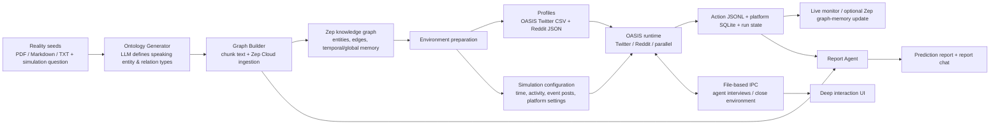
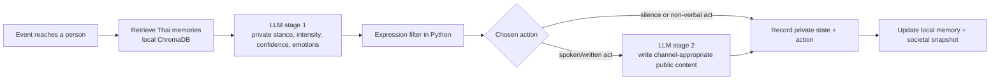
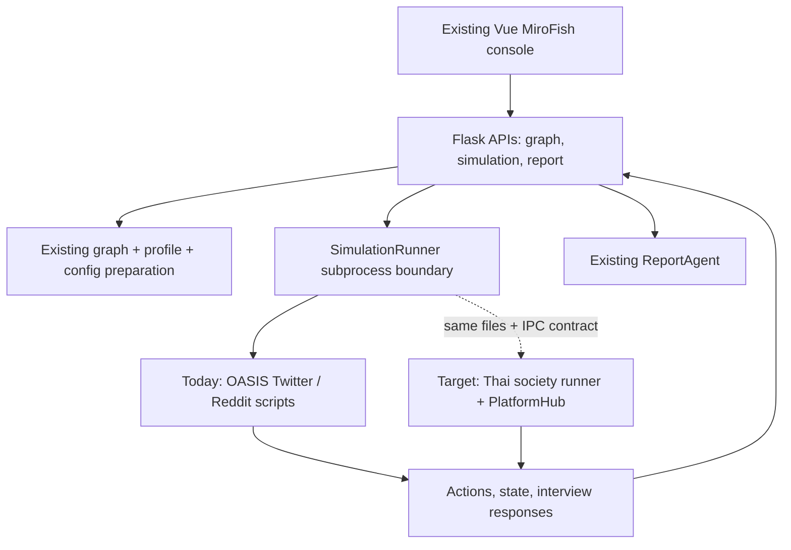

# MiroFish / DEEDY — Architecture and Workflow Guide

This folder contains two related, but different, simulation engines:

1. **MiroFish application engine** — an end-to-end social-media opinion-simulation console. It converts real-world documents into a knowledge graph, creates OASIS agents, runs Twitter/Reddit simulations, and produces an inspectable report.
2. **DEEDY Thai social-simulation core** — a newer engine for modelling Thai society beyond social media. It explicitly separates what people privately believe from what they publicly express, and supports offline as well as online behaviour.

The intended product is to retain the mature MiroFish console as the outer application and progressively replace its OASIS execution layer with the DEEDY Thai core. This is an architecture review of the checked-in code, not a claim that every planned phase is already integrated.

## What MiroFish does

MiroFish is a **multi-agent what-if simulation system**. A researcher supplies real-world “seed” documents (for example, a news event, policy proposal, or brand crisis) and a question such as “How will public opinion develop if this happens?” The system then:

1. turns the source material into a structured knowledge graph;
2. derives agents/personas from graph entities;
3. asks LLM-driven agents to interact in a simulated social platform over multiple time rounds;
4. records every action and exposes live status; and
5. asks a report agent to interrogate the resulting graph, logs, and agents before writing a prediction report.

The public [MiroFish demo](https://mirofish-demo.pages.dev/) presents the same product workflow: **Graph Build → Environment Setup → Simulation → Report → Deep Interaction**. Its own UI labels it as a static demo for the deep-agent interactions, so it should be treated as a product/UX reference rather than evidence of a running backend.

## The two engines at a glance

| Area | MiroFish application engine (current console) | DEEDY Thai social core (new engine) |
| --- | --- | --- |
| Primary question | How does opinion spread and interact on social platforms? | What do people in Thai society privately think, publicly say, and actually do? |
| Simulation runtime | `camel-oasis` / OASIS | Custom `core/` Python runtime |
| World | Twitter and/or Reddit | Society-level channels: public social media, LINE, family/work/community talk, offline action, silence |
| Agent decision | OASIS chooses from platform actions through an LLM | LLM forms a private opinion; deterministic/probabilistic code selects an allowed action; LLM writes public wording only when needed |
| Memory | Zep Cloud graph, including optional updates from simulated activity | Per-agent local ChromaDB memory with Thai multilingual embeddings; ranked by relevance, recency, and importance |
| Social topology | OASIS platform graph; generated configuration includes stance-based homophily | Currently a fully connected prototype; multilayer social, LINE, family/work, and community networks are planned |
| Main output | Posts/comments/actions, platform databases, logs, report, agent interview answers | Private stance, emotions, selected action, exposure, public content, silence count, societal snapshot |
| Current integration | Connected to the Vue frontend and Flask API | Standalone FastAPI prototype; adapter into the MiroFish console is planned, not present |

`frontend-v2/` is **not a third engine**. It is a React/Vite visual prototype for a simpler “Scenario Studio → Live Arena → Insight Reports” experience. Its pages use generated nodes, sample tweets, and generated report rows, rather than calling the backend.

## 1. MiroFish application engine

### End-to-end workflow



### Step 1 — create the project and graph

The Vue frontend sends uploaded source files and a simulation requirement to the Flask API. The graph workflow is implemented by `app/api/graph.py`, `OntologyGenerator`, and `GraphBuilderService`.

- The **ontology generator** asks an LLM to define entity types, relationship types, and attributes appropriate to the supplied scenario. Its prompt intentionally restricts entity types to entities that can plausibly “speak,” rather than abstract concepts.
- The **graph builder** chunks the text, creates a standalone Zep Cloud graph, uploads batches of chunks, waits for ingestion, and then retrieves the resulting node/edge information.
- The graph becomes the shared source of factual context. It holds the document-derived entities, relationships, and temporal knowledge that later personas and reports can query.

### Step 2 — prepare the simulation environment

`SimulationManager.prepare_simulation()` turns the graph into an executable OASIS environment.

1. `ZepEntityReader` reads and filters entities from the selected graph.
2. `OasisProfileGenerator` uses each entity plus graph-search context to generate a detailed persona. It writes OASIS-compatible profiles as `twitter_profiles.csv` and/or `reddit_profiles.json`.
3. `SimulationConfigGenerator` uses the simulation question, original documents, and graph entities to generate:
   - duration and minutes per round;
   - Thai activity schedules and agent behaviour settings;
   - event/initial-post activation;
   - Twitter and Reddit recommendation/platform parameters; and
   - a reproducible social-follow topology that favours agents with similar stances (homophily).
4. The preparation result is persisted in the simulation directory as `state.json`, profile files, and `simulation_config.json`.

### Step 3 — execute and monitor OASIS

`SimulationRunner` launches an isolated Python subprocess for one of three run modes:

- `run_twitter_simulation.py`
- `run_reddit_simulation.py`
- `run_parallel_simulation.py` (both platforms)

Each runner builds an OASIS agent graph from the profiles, creates an OASIS environment, injects initial event posts, activates agents on a time schedule, and advances the environment round by round. The allowed action set is platform-specific: for example, Twitter permits posting, liking, reposting, following, quoting, and doing nothing; Reddit additionally supports comments, voting, search, trends, refresh, and mute.

The runner writes a durable execution trail:

```text
uploads/simulations/<simulation-id>/
├── simulation_config.json
├── twitter_profiles.csv
├── reddit_profiles.json
├── twitter/actions.jsonl
├── reddit/actions.jsonl
├── twitter_simulation.db / reddit_simulation.db
├── run_state.json
├── simulation.log
├── ipc_commands/
└── ipc_responses/
```

The Flask-side monitor tails the action logs every two seconds, updates `run_state.json`, and exposes status, timeline, posts, comments, actions, and agent statistics to the UI. When enabled, `ZepGraphMemoryUpdater` batches agent activity back into Zep so subsequent analysis can see the simulation’s evolving temporal memory.

### Step 4 — report generation

`ReportAgent` produces the final report through a ReAct-style loop: it plans an outline, gathers evidence for each section with tools, drafts the section, and reflects on completeness/accuracy.

Its evidence tools include:

- **InsightForge** — deep attribution across global and local graph memory;
- **PanoramaSearch** — breadth-style graph exploration and relationship chains;
- **QuickSearch** — targeted graph/node/edge lookup;
- **InterviewSubAgent** — virtual interviews with simulated people; and
- **Trace statistics** — deterministic counts and distributions read directly from action logs.

The final tool is important: it lets the report ground claims in recorded execution traces rather than inventing numerical outcomes.

### Step 5 — deep interaction

After normal rounds complete, the OASIS process can remain alive in a waiting state. The Flask API writes command JSON files; the simulation runner polls them, executes agent interviews or batch interviews, writes a response JSON file, and can close the environment on command. This deliberately simple file-based IPC boundary keeps the UI/backend independent from the in-memory OASIS process.

## 2. DEEDY Thai social-simulation core

### Why this engine exists

The OASIS layer models *social platforms*. It does not natively model people who never post, private versus public opinion, legal fear, Thai social deference, or real-world action. DEEDY reframes the unit of simulation as a person in society, not simply a platform user.

Its central hypothesis is **preference falsification**: observed public posts need not equal private opinion. A person may oppose an issue privately but stay quiet, use euphemism, speak only in a LINE group, or choose an offline action.



### Agent model

Every `GenerativeAgent` contains three complementary layers.

| Layer | Stored fields / responsibility |
| --- | --- |
| Stable profile | Age, occupation, region, education, income, personality, influence, deference, seniority pressure, and media access |
| Changing private state | Anger, fear, boredom, and a `PrivateOpinion` containing stance, intensity, confidence, and private thought |
| Public expression | Chosen action, channel, exposure, optional public content, and whether the agent held back |

`MediaAccess` determines which channels a person can use: social media, LINE, television, and community. This means an agent who does not use social media can still receive and act on an event through other channels in the intended design.

### Reaction cycle

For each activated agent, `GenerativeAgent.react()` follows this sequence:

1. **Remember:** retrieve the most relevant previous memories for the event.
2. **Think privately:** an LLM receives the profile, event, memories, previous opinion, and a precise definition of what “supportive” and “opposing” mean in this scenario. It returns a private stance, intensity, confidence, thought, anger, and fear.
3. **Choose behaviour in code:** `expression.py` scores the permitted actions and randomly samples one using a seeded RNG. This is intentionally *not* delegated to the LLM.
4. **Express only if appropriate:** a second LLM call writes natural Thai public content for expressive actions. Silence and non-verbal actions avoid this call.
5. **Remember and log:** the agent stores what happened and returns a structured record containing both the hidden opinion and observable behaviour.

Separating stages 2 and 3 makes the mechanism measurable and reproducible. It prevents the model’s prompt-format sensitivity from being mistaken for a social mechanism such as fear.

### Expression filter and action space

The filter considers:

- emotion and opinion intensity (`drive`);
- legal fear, which raises the cost of every visible channel;
- deference and seniority pressure, weighted by the relationship/channel;
- an action’s public exposure, satisfaction, minimum drive, required media access, and stance direction; and
- the scenario’s allowed actions, so an irrelevant behaviour cannot occur just because it exists globally.

Action families include public online posts/shares/evasive speech; closed LINE sharing; family, workplace, and community conversations; offline action such as protesting, petitions, complaints, boycotts, stockpiling, moving money, purchasing anyway, and publicly defending; plus **silent opinion change**. Silence is an explicit result, not missing data.

Built-in scenario templates (`political`, `consumer`, and `disaster`) attach both an action subset and a clear reference point for the stance. This prevents meaningless results such as a “supportive” agent boycotting without knowing what they support.

### Memory and Thai-language support

DEEDY uses a per-agent `MemoryStream` backed by persistent ChromaDB. It uses `intfloat/multilingual-e5-small` by default, normalises Thai text, and ranks candidate memories using a weighted combination of:

- semantic relevance;
- recency in **simulated** time; and
- stored importance.

Embeddings and vector storage stay local. This provides repeatable retrieval, avoids sending potentially sensitive collected text to the cloud, and is suited to high-frequency per-agent memory operations. Zep remains useful in the larger system for event knowledge and report-oriented graph analysis, not as this high-churn personal-memory layer.

### World orchestration and current API

`PlatformHub` manages the population and simulation clock. At each event round it advances everyone’s simulated time, applies aggregate emotional contagion, activates a subset of people (default 15%, boosted by existing anger/opinion intensity), and runs active agents concurrently with a limit of 30 requests. Its snapshot reports population-level private-stance distribution plus average anger and fear.

`backend/main.py` exposes this core as a small FastAPI service:

- `GET /` — configuration and population health;
- `GET /simulate/state` — societal snapshot; and
- `POST /simulate/event` — broadcast an event and return reactions, including silence.

At present this API seeds only three hard-coded example Thai personas. It is therefore suitable for testing the agent mechanism, not for interpreting real population-level forecasts.

## Thai data pipeline and safeguards

The new `core/pipeline/` contains supporting pieces for a data-driven Thai workflow:

- **Source registry:** collection is fail-closed; an unknown domain cannot be collected until its robots/terms policy is registered.
- **Provenance:** every accepted document must carry its URL, publisher, collection time, collector, licence, collector version, and a content hash for deduplication.
- **Thai-aware views:** raw text is preserved; normalised, tokenised, and language-style views are derived separately. Buddhist Era year detection is contextual rather than blindly converting all four-digit numbers.
- **Privacy boundary:** `author_ref` is designed as an anonymised reference, not a real-name field; collection and use restrictions are explicit.

Topic discovery, live source adapters, weak annotation, PII cleaning, population generation from national statistics, and validation protocols remain incomplete/planned according to `PLAN.md`. These gaps matter: provenance scaffolding is not yet an end-to-end data acquisition pipeline.

## How the engines are meant to connect

The existing MiroFish console already has a useful replaceable-runtime seam. It starts an external runner and depends on three file contracts:

1. **Inputs:** `simulation_config.json` and profile data inside the simulation directory.
2. **Execution trace:** `<simulation-dir>/<platform>/actions.jsonl`, with round, time, agent identity, action type/arguments, result, and success fields.
3. **Interaction:** the runner polls the file-based IPC command queue and writes responses.

The planned `run_thai_society_simulation.py` should drive `core.PlatformHub` while honouring these same contracts. It can include private opinion, intensity, fear, chosen channel, and exposure inside `action_args`. With that adapter in place, the existing Flask APIs, Vue monitor, report agent, and interaction UI can be reused instead of rebuilt.



### Integration status

| Capability | Status in this repository |
| --- | --- |
| MiroFish graph → profile → OASIS → monitor → report workflow | Implemented |
| OASIS Twitter, Reddit, and parallel runners | Implemented |
| File-based interview/close IPC | Implemented |
| Thai private-opinion / expression-filter agent logic | Implemented in `backend/core/` |
| Thai memory with local multilingual embeddings | Implemented in `backend/core/` |
| Thai core FastAPI demonstration service | Implemented, three hard-coded personas |
| Thai multilayer network, empirical population, and source-collection workflow | Not yet complete |
| `run_thai_society_simulation.py` adapter and `thai_society` runner option | Planned; not found in the repository |
| Real backend connection for `frontend-v2/` | Not implemented; it is a mock UI |

## Repository map

| Path | Role |
| --- | --- |
| `frontend/` | Main Vue MiroFish console, including the five-step workflow |
| `backend/app/api/` | Flask APIs for graph building, simulation management/monitoring, reporting, and interaction |
| `backend/app/services/` | Zep graph builder, ontology/profile/config generation, OASIS launcher, IPC, graph-memory updates, report agent |
| `backend/scripts/` | OASIS Twitter, Reddit, and parallel simulation subprocess runners |
| `backend/core/` | DEEDY Thai agents, actions, expression filter, scenarios, memory, embeddings, environment, and data-pipeline primitives |
| `backend/main.py` | Standalone FastAPI entry point for the DEEDY prototype |
| `frontend-v2/` | React UI concept/prototype; not connected to a backend |
| `PLAN.md` | Detailed research and engineering roadmap, design decisions, experimental notes, and limitations |
| `project_ideas_and_research.md` | Thai-localisation goals, data/RAG guidance, and ethics notes |

## Practical interpretation rules

- Treat both systems as **scenario exploration**, not a machine that can establish real public opinion or predict the future with certainty.
- Treat OASIS results as **platform-behaviour simulations**; they do not represent people who do not use the simulated platforms.
- Do not infer private Thai opinion from public expression alone; that distinction is the main contribution of the DEEDY design.
- Do not make population claims from the current three-person DEEDY API seed.
- Preserve source rights, provenance, temporal cut-offs, and privacy controls before using real data for research or product decisions.

## Primary implementation references

- [MiroFish public demo](https://mirofish-demo.pages.dev/)
- `backend/app/services/{graph_builder,ontology_generator,simulation_manager,simulation_runner,report_agent}.py`
- `backend/scripts/run_{twitter,reddit,parallel}_simulation.py`
- `backend/core/{agent,expression,actions,environment,memory_stream,scenario}.py`
- `backend/core/pipeline/{sources,provenance,views}.py`
- `PLAN.md`
