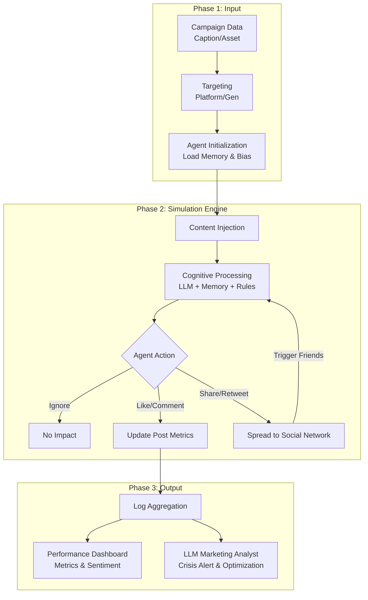

# Design Spec: MarketFish (Thai Social Media Marketing Simulator)

## 1. Project Overview

**เป้าหมาย (Goal):** ปรับทิศทางโปรเจกต์ (Pivot) จากแพลตฟอร์มจำลองสังคมทั่วไป (MiroFish) เป็น **เครื่องมือจำลองการทำการตลาดบนโซเชียลมีเดีย (Social Media Marketing Simulator)** ที่ออกแบบมาเพื่อสังคมไทยโดยเฉพาะ เพื่อให้นักการตลาดสามารถทดสอบคอนเทนต์, พยากรณ์เทรนด์, และคาดการณ์ผลลัพธ์ (A/B Testing, Crisis Prediction) ก่อนการใช้งบโฆษณาจริง

## 2. Core Engine Architecture (สถาปัตยกรรมระบบ)

เครื่องยนต์หลักจะเปลี่ยนจากสมการคณิตศาสตร์ตายตัว เป็น **LLM-driven Agent Network** ที่มีคุณสมบัติดังนี้:

### 2.1 Agent Cognitive System (ระบบความคิดและความจำ)

* **Memory Stream:** Agent บันทึกประวัติการเห็นคอนเทนต์และการสนทนากับผู้อื่น (Long-term / Short-term memory)
* **Reflection & Belief:** Agent สามารถ "ตกตะกอน" ข้อมูลในอดีตเพื่อสร้าง Bias หรือความเชื่อส่วนตัวต่อแบรนด์ (เช่น ซื่อสัตย์ต่อแบรนด์ หรือ แอนตี้แบรนด์)
* **Dynamic Opinion:** ความคิดเห็นของ Agent เปลี่ยนแปลงได้แบบ Real-time ตามกระแสสังคม (Bandwagon Effect) และแรงกดดันทางสังคม (Peer Pressure)

### 2.2 Thai Social Dynamics (กลไกพฤติกรรมสังคมไทย)

* **Hierarchical Trust (ระบบความน่าเชื่อถือ):** Agent ที่มีระดับ "ผู้ใหญ่" หรือ "KOL" จะมีอิทธิพลในการโน้มน้าว (Persuasion) Agent ที่เป็น "ผู้น้อย/ลูกหาบ" ได้ง่ายกว่า
* **Kreng-Jai (ความเกรงใจ):** การแสดงออกหน้าไมค์กับหลังไมค์อาจไม่ตรงกัน เพื่อรักษาหน้า (Face-saving) หรือเลี่ยงความขัดแย้ง
* **Echo Chambers:** Agent มีแนวโน้มรวมกลุ่มกับคนที่มีความชอบคล้ายกัน (Homophily) ทำให้เกิดกระแสตีกลับ (Polarization) ได้ง่าย

## 3. Platform & Generation Matrix (พฤติกรรมตามบริบท)

Agent จะถูกควบคุมพฤติกรรม (Boldness, Attention Span, Aesthetic preference) ตามแพลตฟอร์มและอายุ:

### Platform Rules

* **X (Twitter):** ความเกรงใจต่ำ, ไวต่อดราม่า, พร้อมเปิดวอร์ (Cancel Culture) และรวมกลุ่มไว
* **Facebook:** ความเกรงใจปานกลาง, เน้นคอมเมนต์ยาว เล่าเรื่องสไตล์คนมุง, และมักตามน้ำเพจใหญ่
* **TikTok:** ความอดทนต่ำ (Short Attention Span), เสพความบันเทิง, เกลียดการขายตรง, เน้นคอมเมนต์สั้นเอาฮา
* **Instagram:** เน้นสุนทรียภาพ (Aesthetic-driven), คอมเมนต์หน้าฟีดเป็นพลังบวก, แต่จะมีการนำเรื่องไปนินทาใน Close Friends (Private Echo Chamber)

### Generation Rules

* **Gen Z:** ไวต่อความจริงใจ (Authenticity), แอนตี้ความ Cringe, มีพลังป้ายยาสูง
* **Gen Y:** เน้นข้อมูลประกอบการตัดสินใจ, สนใจเรื่องความคุ้มค่าและ Work-life balance
* **Gen X/Boomer:** เคารพผู้อาวุโส, เชื่อแบรนด์ที่มีความน่าเชื่อถือสูง, ส่งต่อข้อมูลไว

## 4. System Pipeline Workflow (ลำดับการทำงานของระบบ)

สถาปัตยกรรม Pipeline ถูกแบ่งออกเป็น 3 ระยะ (Input -> Engine -> Output) ดังนี้:

### 4.1 Phase 1: Input & Configuration (การตั้งค่าแคมเปญ)

นักการตลาดจะต้องกำหนดบริบทเริ่มต้นของการจำลอง:

* **Campaign Brief:** แคปชั่น, รูปภาพ (หรือ Text description ของรูป), วัตถุประสงค์ (เช่น เน้นยอดขาย, เน้นการรับรู้)
* **Targeting & Constraints:** เลือก Demographics (Gen Z, Y, X), กำหนดแพลตฟอร์มเป้าหมาย (X, FB, IG, TikTok)
* **Agent Environment Setup:** ระบบจะดึง Agent ที่เป็นกลุ่มเป้าหมายขึ้นมา (Instantiate) พร้อมโหลดประวัติความจำ (Memory Stream) และอคติเดิม (Bias) ที่มีต่อแบรนด์

### 4.2 Phase 2: Engine Execution (วงจรการจำลอง)

วงจรนี้จะทำงานเป็น Loop เพื่อสร้างปรากฏการณ์ทางสังคม (Social Dynamics):

1. **Content Injection:** โพสต์แคมเปญจะถูกโยนเข้าไปในฟีดของ Agent กลุ่มแรก (Seed Audience)
2. **Cognitive Processing:** Agent แต่ละตัวที่เห็นโพสต์จะดึง `Memory` มาประมวลผลร่วมกับ `Platform Rule` (เช่น อยู่บน X ความเกรงใจจะต่ำ) และ `Generation Traits`
3. **Action Selection:** Agent จะตัดสินใจทำ Action เช่น เลื่อนผ่าน (Ignore), กดไลก์ (Like), คอมเมนต์ (Comment), หรือแชร์/โควท (Share)
4. **Network Propagation (Opinion Dynamics):** หาก Agent แชร์หรือคอมเมนต์ ข้อมูลจะเด้งไปหา Agent ตัวอื่นๆ ใน Network (เช่น ผู้ติดตามหรือเพื่อน)
5. **Reaction Loop:** Agent ตัวอื่นเห็นโพสต์จากเพื่อน -> ถูกโน้มน้าว (Persuasion) หรือรู้สึกขัดแย้ง (Dissonance) -> แสดงความเห็นต่อ -> เกิดเป็นโดมิโน่เอฟเฟกต์ (Viral หรือ Echo Chamber)

### 4.3 Phase 3: Output & Analytics (การประมวลผลลัพธ์เชิงการตลาด)

เมื่อจำลองจนครบเวลาที่กำหนด (เช่น จำลอง 24 ชั่วโมงจบใน 5 นาที) ระบบจะประมวลผล Log ทั้งหมดออกมา:

* **Performance Metrics:** ตัวเลขคาดการณ์ Reach, Engagement Rate, โอกาสติดเทรนด์
* **Audience Sentiment:** วัดทัศนคติ (บวก/ลบ/กลาง) แยกตาม Gen และแพลตฟอร์ม
* **LLM Marketing Analyst:** ใช้ LLM สรุปจุดบกพร่องและแนวทางแก้ไข (เช่น "แคมเปญนี้มีโอกาสเกิดดราม่าในกลุ่ม Gen Z บน X เพราะใช้คำที่ละเอียดอ่อน แนะนำให้เปลี่ยนคำเป็น...")

---
---

## 5. Frontend & UI Design (การออกแบบหน้าเว็บจำลองการตลาด)

เพื่อให้การป้อนข้อมูล (Input) เป็นไปอย่างละเอียดและใช้งานง่าย หน้าเว็บของ MarketFish จะถูกออกแบบในสไตล์ **Command Center สำหรับนักการตลาด** โดยมีฟีเจอร์และหน้าจอหลักๆ ดังนี้:

### 5.1 Dashboard (หน้าแรก)

* **Active Simulations:** แสดงรายการแคมเปญที่กำลังรันอยู่ พร้อมเปอร์เซ็นต์ความคืบหน้า
* **Past Results:** ประวัติการจำลองแคมเปญเก่า พร้อมป้ายกำกับ (เช่น `Safe`, `Viral`, `Crisis Risk`)
* **Global Mood Board:** กราฟแสดง "อารมณ์รวมของสังคมจำลองในวันนี้" (เช่น วันนี้ Agent ส่วนใหญ่กำลังเครียดเรื่องการเมือง คอนเทนต์ตลกอาจจะแป้ก)

### 5.2 Simulation Wizard (หน้าป้อนข้อมูล Input แบบละเอียด)

แบ่งการกรอกข้อมูลเป็น 3 ขั้นตอน (Steps):

#### Step 1: Campaign Brief (เป้าหมายแคมเปญ)

* **Objective Selector:** เลือกเป้าหมายหลัก (Brand Awareness / Sales Conversion / Damage Control สำหรับเทสต์คำขอโทษ)
* **Brand Voice:** กำหนดบุคลิกแบรนด์ (เช่น ทางการ, เป็นกันเอง, วัยรุ่น) เพื่อให้ LLM Analyst ประเมินได้ถูกว่าแคปชั่นขัดกับบุคลิกไหม

#### Step 2: Content Studio (ตัวสร้างคอนเทนต์จำลอง)

* **Platform Preview:** หน้าจอ Preview แบบ Real-time ที่จะเปลี่ยน UI ไปตามแพลตฟอร์มที่เลือก (เหมือนหน้าจอ Twitter/FB/IG จริงๆ)
* **Caption Box:** ช่องกรอกข้อความที่รองรับ Hashtag และ Emoji
* **Media Uploader:** อัปโหลดรูปภาพ/วิดีโอ (ระบบอาจใช้ Vision API เพื่อแปลงภาพเป็น Text Description ให้ Agent อ่าน)

#### Step 3: Audience & Environment Targeting (กำหนดเป้าหมาย)

* **Demographic Sliders:** แถบเลื่อนกำหนดสัดส่วนประชากรจำลอง (เช่น Gen Z 50%, Gen Y 30%, Gen X 20%)
* **Interest Tags:** กำหนดความสนใจเฉพาะกลุ่ม (เช่น สายบิวตี้, สายไอที, ติ่งเกาหลี)
* **Network Modifiers (Advanced):**
  * *KOL Injection:* เลือกเปิดใช้งาน Agent ที่มีผู้ติดตามสูง (KOLs) ให้เป็นคนเปิดประเด็น
  * *Pre-existing Bias:* กำหนดสถานะเริ่มต้นของแบรนด์ (เช่น "แบรนด์กำลังมีดราม่า", "แบรนด์เป็นที่รัก")

### 5.3 Live Simulation & Analytics (หน้าแสดงผลลัพธ์)

* **The Matrix Feed:** หน้าจอแสดงผลแบบ Real-time เห็นคอมเมนต์และยอดแชร์ของ Agent วิ่งขึ้นมาสดๆ
* **Performance Metrics:** Dashboard สรุปตัวเลข (Reach, Engagement, Sentiment)
* **AI Marketing Advisor Panel:** แผงคำแนะนำจาก AI สรุปว่า "ควรไปต่อ หรือ เปลี่ยนแคปชั่น" พร้อมชี้จุดเสี่ยง

---

## 6. Backend Engine Architecture (เจาะลึกสถาปัตยกรรม Engine)

Engine หลังบ้านจะถูกออกแบบให้เป็น **Microservices & Event-Driven Architecture** เพื่อรองรับการทำงานของ Agent หลายตัวพร้อมกันแบบไม่สะดุด โดยมีโมดูลหลักดังนี้:

### 6.1 Agent Orchestrator (ตัวควบคุมจังหวะเวลา)

* **Tick System:** ระบบเวลาจำลอง (Simulation Clock) ที่จะเดินหน้าทีละสเต็ป (Tick) เช่น 1 Tick = 5 นาทีในโลกจริง
* **Action Scheduler:** ทำหน้าที่จัดคิวให้ Agent แต่ละตัวทำงานพร้อมกัน (Concurrency) โดยใช้เทคโนโลยีอย่าง `asyncio` หรือ Message Queue (เช่น RabbitMQ/Kafka) เพื่อรองรับ Scale

### 6.2 Cognitive & LLM Module (สมองของ Agent)

การตัดสินใจของ Agent จะถูกห่อหุ้ม (Wrapped) ด้วย Prompt Engine ที่ซับซ้อน:

* **Persona Builder:** ดึงข้อมูลจากฐานข้อมูลมาต่อกันเป็น System Prompt:
  * `[Base Profile]` (เช่น หญิง, 24 ปี, ทำงานออฟฟิศ)
  * `[Platform Rule]` (เช่น ตอนนี้อยู่บน X ให้กล้าด่า)
  * `[Current Emotion]` (อารมณ์ปัจจุบันจาก Memory)
* **LLM API Gateway:** ส่ง Prompt ไปหา LLM (เช่น OpenAI, vLLM สำหรับโมเดลภาษาไทย) และบังคับให้ตอบกลับมาเป็น JSON เสมอ (เช่น `{"action": "COMMENT", "text": "...", "sentiment": -1}`)

### 6.3 Dual-Memory System (ระบบความจำ)

เพื่อให้ Agent มีพัฒนาการและเปลี่ยนใจได้:

* **Short-term Working Memory (Redis):** เก็บข้อมูลที่เพิ่งเกิดขึ้นใน 1-2 ชั่วโมงที่ผ่านมา (เช่น เพิ่งเห็นโพสต์, เพิ่งโดนเพื่อนด่า) เพื่อความรวดเร็วในการเรียกใช้
* **Long-term Memory (Vector DB - ChromaDB):** เก็บความจำถาวรและอคติ เมื่อเวลาผ่านไป Engine จะมี **Reflection Worker** แอบทำงานอยู่เบื้องหลัง เพื่อเอา Short-term memory มา "สรุปตกตะกอน" แล้วยัดลง Vector DB กลายเป็นความเชื่อฝังลึก

### 6.4 Social Graph Topology (โครงสร้างความสัมพันธ์)

* ใช้ **NetworkX** หรือ **Graph DB (Neo4j)** ในการเก็บข้อมูลว่าใครติดตามใคร ใครเป็นหัวหน้าใคร
* **Propagation Logic:** เมื่อ Agent A กด "Share" ระบบจะดู Graph ว่าใครเชื่อมกับ A บ้าง แล้วเอาคอนเทนต์นั้นไปยัดใส่ "Observation Queue" ของเพื่อนๆ ให้เพื่อนเห็นใน Tick ถัดไป

### 6.5 Action Engine & Analytics (ระบบประมวลผลการกระทำ)

* เมื่อ LLM ตอบ JSON กลับมา Action Engine จะแปลงเป็นพฤติกรรมจริง (เซฟลง DB ว่าเกิดคอมเมนต์ใหม่)
* **Real-time Streamer:** ส่งข้อมูลอัปเดตผ่าน WebSocket ไปยัง Frontend (หน้า Matrix Feed) ทันทีให้นักการตลาดเห็น

## 7. Advanced Research Integrations (ยกระดับตามงานวิจัยล่าสุด)

จากการทำ Deep Research เพื่อให้ระบบรองรับสเกลระดับประเทศและสะท้อนสังคมจริงได้ เราต้องเพิ่ม 2 แกนนี้เข้าไปในระบบ:

### 7.1 Tech Perspective (การสเกลและคุมต้นทุน LLM)

การเรียกใช้ LLM ตัวใหญ่ (เช่น GPT-4o) ให้ Agent หมื่นตัวพร้อมกันจะทำให้เซิร์ฟเวอร์ล่มและค่า API มหาศาล สิ่งที่ต้องเพิ่มคือ:

* **LLM Tiering & Routing:** ใช้โมเดลเล็ก (Local LLM หรือ Rule-based) สำหรับแอคชั่นง่ายๆ (เช่น การกดไลก์, เลื่อนผ่าน) และเรียกใช้โมเดลใหญ่เฉพาะตอนที่ Agent ต้องคอมเมนต์ยาวๆ หรือเปลี่ยนทัศนคติ (Deep Reflection)
* **Semantic Prompt Caching:** แคช Prompt ของ Agent ที่มี Persona เหมือนกัน เพื่อลดจำนวน Token ที่ต้องส่งไปประมวลผลซ้ำๆ
* **Hybrid ABM (Agent-Based Modeling):** Agent ที่เป็นแค่ "ไทยมุง" จะใช้สมการคณิตศาสตร์คำนวณแบบเก่า ส่วน Agent ที่เป็น "KOL หรือ หัวโจก" จะใช้ LLM

### 7.2 Social Perspective (อัลกอริทึมและพฤติกรรมมืด)

ในโลกโซเชียลจริง การกระจายข่าวไม่ได้เกิดจากเพื่อนสู่เพื่อน (Social Graph) อย่างเดียว ระบบต้องมี:

* **Recommendation Algorithm Simulator:** จำลอง "อัลกอริทึมของแพลตฟอร์ม" (เช่น For You Page ของ TikTok) ที่จะสุ่มโยนโพสต์ไปให้ Agent นอก Network เห็น ถ้าคอนเทนต์นั้นมี Engagement Score สูงพอ
* **Astroturfing & IO (ขบวนการปั่นกระแส):** เพิ่มโหมด "บัญชีหน้าม้า/บอทปั่นเทรนด์" เข้าไปในระบบ เพื่อให้นักการตลาดทดสอบได้ว่า ถ้าคู่แข่งใช้ IO โจมตีแบรนด์เราใน X (Twitter) Agent ที่เป็นคนปกติจะคล้อยตามไหม (Simulating Misinformation Diffusion)

---
> **สถานะปัจจุบัน:** ไฟล์นี้ผ่านการวิจัยเชิงลึกแล้ว (Final Design Spec) หากเห็นชอบตามนี้ จะเข้าสู่ขั้นตอนเขียน Implementation Plan เพื่อเริ่มพัฒนาจริง
